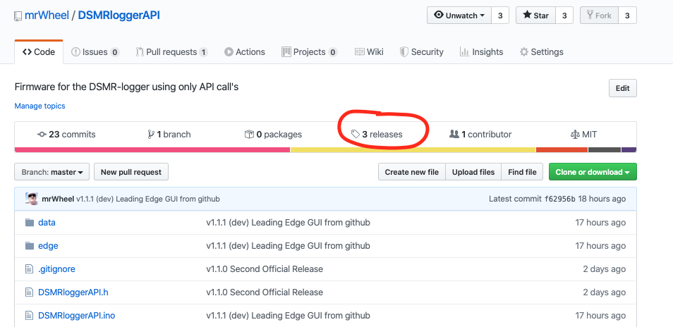
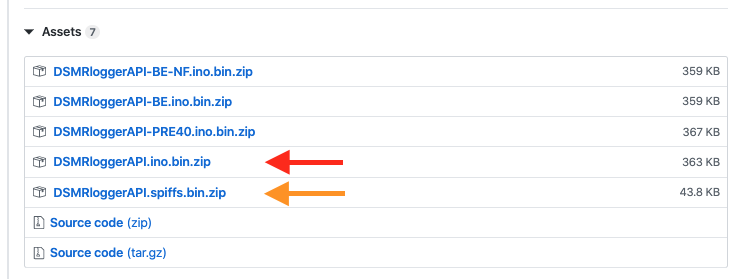
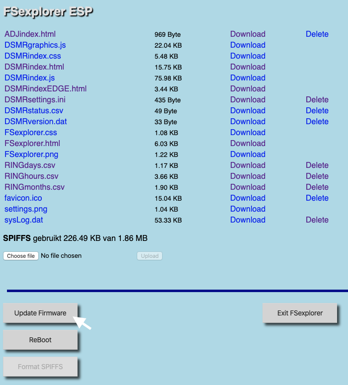
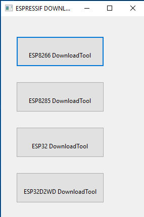

# Nieuwe DSMRloggerAPI firmware flashen

Nieuwe DSMRloggerAPI firmware kan via de web-interface van de DSMR-logger "_Over the Air_" geflashed worden maar mocht dat, om de één of andere manier niet lukken dan kunnen de pré compiled binaries ook bedraad geflashed worden.

1. [OTA met de Update Server flashen](nieuwe-dsmrloggerapi-firmware-flashen.md#pre-compiled-binaries)
2. [Bedraad met het Espressif flash Tool](nieuwe-dsmrloggerapi-firmware-flashen.md#bedraad-flashen-met-het-espressif-flash-tool)


Hoe je de firmware moet upgraden van _DSMRlogger**WS**_ naar _DSMRlogger**API**_ ****staat [hier](upgrade-dsmrloggerws-naar-dsmrloggerapi.md) beschreven!


### Pre compiled Binaries

Op [github](https://github.com/mrWheel/DSMRloggerAPI) staan van de major releases, voor de meest voorkomende situaties, binaries van zowel de firmware als van het SPIFFS in .zip formaat. 

Klik op "[releases](https://github.com/mrWheel/DSMRloggerAPI/releases)" en download het ino.bin.zip bestand dat voor jouw situatie geschikt is \(deze staan onder iedere release beschrijving bij "_Assets_"\).


Bij een gewone firmware update is het meestal niet nodig ook het SPIFFS opnieuw te downloaden en te flashen.


Onder iedere release beschrijving staan de bijbehorende "_Assets_".


In de beschrijving van de release staat met welke compiler options de verschillende binaries zijn gemaakt. Heb jij andere compiler options nodig dan zul je de sources moeten downloaden en met de Arduino IDE zelf een binary moeten maken.


Als de binary\(s\) op je computer staan dan moet je deze uitpakken \(unzippen\).

Ga nu op de DSMR-logger naar de FSexplorer \(door op het icoon  te klikken\) en klik vervolgens op de knop \[Update Firmware\].

Klik nu op de bovenste \[Choose File\] knop 

Selecteer in het popup-window het zojuist gedownloade en uitgepakte ino.bin file:

Klik op \[Open\] of \[Select\] en klik vervolgens op de knop \[Flash Firmware\].   
Na enige tijd verschijnt het volgende scherm:

.. waarna, als de teller op nul staat het hoofdscherm van de DSMR-logger weer verschijnt.


Alleen als in de beschrijving van een release staat dat ook SPIFFS opnieuw geflased moet worden moet u dit doen. In veel gevallen zal volstaan om eventueel een bepaald bestand naar SPIFFS te uploaden. Ook dit zal dan expliciet in de release beschrijving staan.


### Bedraad flashen met het Espressif Flash tool

Espressif heeft voor zijn ESP-boards een \(helaas alleen Windows\) tool ontwikkeld dat het bedraad flashen erg eenvoudig maakt.

Het tool kun je [hier](https://www.espressif.com/en/support/download/other-tools) downloaden.

Pak het .zip file uit \(unzip\) en start het door op het mapje te klikken:

Klik nu op "flash\_download\_tools.exe" en selecteer \[esp8266 DownloadTool\] in het volgende scherm:

Selecteer de twee bin bestanden. Het x.ino.bin bestand moet op adres 0x0 starten, het x.spiffs.bin op 0x200000. Selecteer de COM poort waar de DSMR-logger op is aangesloten, zet de DSMR-logger in flash mode en klik op \[START\]. Na enige tijd krijg je de melding dat alles goed is gegaan.

